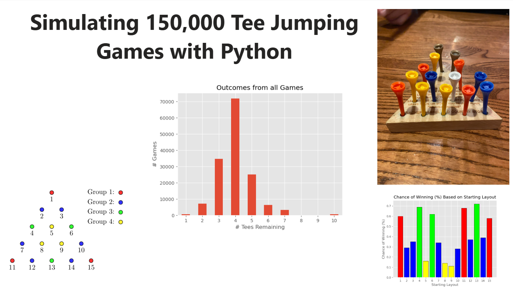

## Overview

The "Tee Jumping" board game is simulated using Python in a Jupyter Notebook. 150,000 games are played in order to investigate potential strategic advantages. In particular, the focus is to find which choices of starting layouts of the game lead to the highest chance of success, when playing the game with no strategy, in a completely random way.

The project was created to practice:
- Simulating and implementing complex processes using Python.
- Using pandas DataFrames to effectively store and transform the results of the simulations.
- Visualizing results clearly and neatly to gain useful insight into the data.

## Tools and Methods Used

- Jupyter Notebook, to diplay Python code, results, imported pictures and resulting visualizations, accompanied by a clear description of the process.
- Python, to simulate gameplay, including manipulation of pandas DataFrames and creating visuals using matplotlib.
- Created diagrams to explain thinking clearly using the TikZ package in an online LateX editor.

## Findings

- Insight was gained into the likelihoods of success based on the various starting layouts, leading to a strategic edge.
- Patterns could successfully be seen in the visualization of the data which line up with expectation of results.